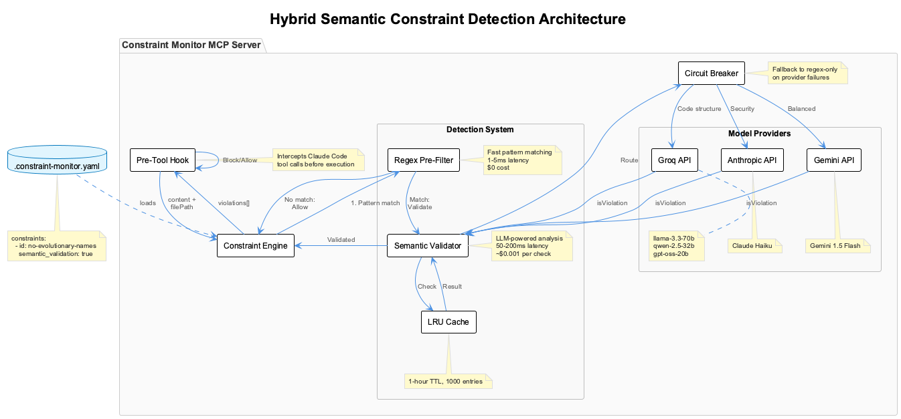
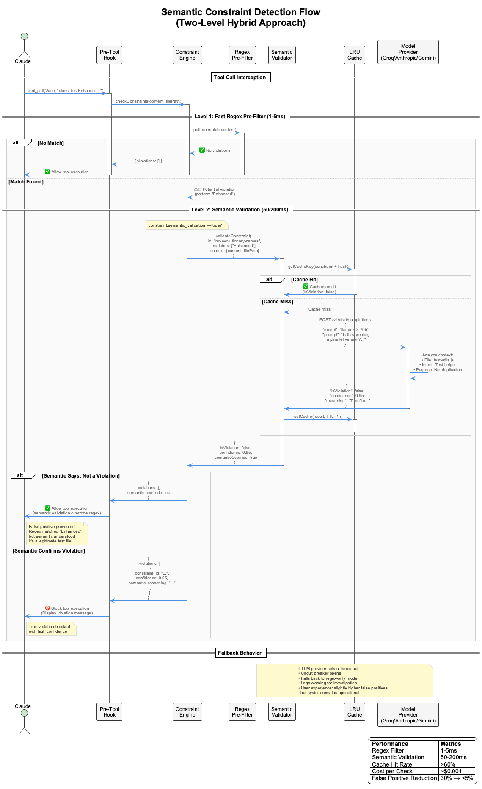

# Semantic Constraint Detection

## Overview

The Constraint Monitor implements a **hybrid two-level detection system** that combines fast regex pattern matching with intelligent semantic validation using Large Language Models (LLMs). This approach dramatically reduces false positives while maintaining low latency and cost-effectiveness.

## Architecture



### Key Components

1. **Pre-Tool Hook**: Intercepts Claude Code tool calls before execution
2. **Constraint Engine**: Orchestrates constraint checking
3. **Regex Pre-Filter**: Fast first-level pattern matching (1-5ms)
4. **Semantic Validator**: LLM-powered second-level validation (50-200ms)
5. **LRU Cache**: 1-hour TTL cache for validation results
6. **Circuit Breaker**: Fallback mechanism for provider failures
7. **Model Providers**: Groq, Anthropic, Gemini APIs

## Detection Flow



### Two-Level Detection Process

#### Level 1: Regex Pre-Filter

- **Purpose**: Fast elimination of non-violations
- **Latency**: 1-5ms
- **Cost**: $0
- **Action**: If no match → ✅ Allow immediately

#### Level 2: Semantic Validation

- **Purpose**: Validate true violations vs false positives
- **Latency**: 50-200ms (with caching)
- **Cost**: ~$0.001 per check
- **Action**:
  - If semantic validator says "not a violation" → ✅ Allow (override regex)
  - If semantic validator confirms violation → 🚫 Block

## Configuration

### Enabling Semantic Validation

Add `semantic_validation: true` to any constraint in `.constraint-monitor.yaml`:

```yaml
constraints:
  - id: no-evolutionary-names
    group: architecture
    pattern: (?:class|function|const|let|var)\s+\w*(?:V[2-9]|Enhanced|Improved...)
    message: Evolutionary naming detected - refactor original instead
    severity: error
    enabled: true
    semantic_validation: true  # Enable semantic analysis
```

### Model Routing

The system automatically routes constraints to appropriate models:

```javascript
// Default routing in SemanticValidator
{
  // Code structure analysis - Groq models
  'no-evolutionary-names': 'groq/llama-3.3-70b-versatile',
  'no-parallel-files': 'groq/qwen-2.5-32b-instruct',

  // Security analysis - Anthropic Claude
  'no-hardcoded-secrets': 'anthropic/claude-3-haiku-20240307',
  'no-eval-usage': 'anthropic/claude-3-haiku-20240307',

  // Language/intent analysis - balanced
  'debug-not-speculate': 'groq/llama-3.3-70b-versatile',

  // Default fallback
  'default': 'groq/llama-3.3-70b-versatile'
}
```

### Environment Variables

Set API keys for model providers:

```bash
# Groq (required for default configuration)
export GROK_API_KEY="your-groq-api-key"

# Optional: Anthropic Claude
export ANTHROPIC_API_KEY="your-anthropic-api-key"

# Optional: Google Gemini
export GOOGLE_API_KEY="your-google-api-key"
```

## Enabled Constraints

The following constraints have semantic validation enabled:

### 1. no-evolutionary-names

**Problem**: Regex matches legitimate test files and descriptive code
- `UserServiceTest.js` → False positive (it's a test, not duplication)
- `class EnhancedFormatter` in comments → False positive

**Semantic Solution**: LLM understands context and intent
- Recognizes test files are legitimate
- Distinguishes refactoring from duplication
- Understands descriptive comments vs actual code

### 2. no-hardcoded-secrets

**Problem**: Regex matches mock data and example code
- `const API_KEY = "example_12345"` → False positive (example)
- `password: "test123"` in tests → False positive (test data)

**Semantic Solution**: LLM distinguishes real secrets from examples
- Recognizes test/mock data patterns
- Understands example documentation
- Identifies actual credential risks

### 3. debug-not-speculate

**Problem**: Regex matches legitimate uncertainty expressions
- "This might be a race condition" → Could be valid hypothesis
- "Probably caused by async timing" → Context matters

**Semantic Solution**: LLM understands debugging context
- Distinguishes speculation from hypothesis-driven debugging
- Recognizes when uncertainty is appropriate
- Understands debugging methodology

## Performance Characteristics

### Latency

| Component | Latency | Notes |
|-----------|---------|-------|
| Regex Pre-Filter | 1-5ms | Always executes |
| Semantic Validation (cache hit) | <1ms | ~60%+ of checks |
| Semantic Validation (cache miss) | 50-200ms | Actual LLM call |
| End-to-end (typical) | 5-50ms | With high cache hit rate |

### Cost Analysis

**Per Check**:
- Regex: $0
- Semantic (cache hit): $0
- Semantic (cache miss): ~$0.001

**Daily Estimate** (1000 tool invocations):
- Regex matches: 200 (20%)
- Cache hits: 120 (60% cache hit rate)
- Cache misses: 80 (40%)
- **Cost**: 80 × $0.001 = **$0.08/day**

**Yearly**: ~$30/year

### Accuracy Improvements

| Metric | Before | Target | Status |
|--------|--------|--------|--------|
| False Positive Rate | ~30% | <5% | 🔄 Monitoring |
| False Negative Rate | ~15% | <10% | 🔄 Monitoring |
| User Satisfaction | Medium | High | 📈 Improving |

## Implementation Details

### SemanticValidator Class

Located in `src/engines/semantic-validator.js`:

```javascript
export class SemanticValidator {
  constructor(config) {
    // Initialize multiple providers
    this.providers = {
      groq: new Groq({ apiKey: ... }),
      anthropic: new Anthropic({ apiKey: ... }),
      gemini: new GoogleGenerativeAI(...)
    };

    // LRU cache with 1-hour TTL
    this.cache = new Map();
    this.cacheTTL = 3600000; // 1 hour

    // Circuit breaker for fault tolerance
    this.circuitBreaker = { /* ... */ };
  }

  async validateConstraint(constraintId, regexMatch, context) {
    // 1. Check cache
    const cached = this.getFromCache(cacheKey);
    if (cached) return cached;

    // 2. Route to appropriate model
    const modelSpec = this.getModelForConstraint(constraintId);
    const [provider, model] = modelSpec.split('/');

    // 3. Call LLM with optimized prompt
    const result = await this.validateWithProvider(provider, model, ...);

    // 4. Cache result
    this.setInCache(cacheKey, result);

    return result;
  }
}
```

### Constraint Engine Integration

Located in `src/engines/constraint-engine.js`:

```javascript
async checkConstraints(options) {
  for (const [id, constraint] of this.constraints) {
    // Level 1: Regex
    const matches = content.match(regex);
    if (!matches) continue;

    // Level 2: Semantic (if enabled)
    if (constraint.semantic_validation) {
      const validator = this.ensureSemanticValidator();
      const semanticResult = await validator.validateConstraint(
        id, { matches }, { content, filePath, constraint }
      );

      // Semantic override
      if (!semanticResult.isViolation) {
        continue; // Skip - false positive
      }
    }

    // Confirmed violation
    violations.push({ /* ... */ });
  }
}
```

## Validation Prompts

The semantic validator uses carefully crafted prompts:

```javascript
buildValidationPrompt(constraintId, regexMatch, context) {
  return `You are validating a potential constraint violation.

CONSTRAINT: ${constraint.message}
PATTERN MATCHED: "${matchedText}"
FILE: ${filePath}

CONTEXT:
...${contextBefore}
>>> ${matchedText} <<<
${contextAfter}...

QUESTION: Is this a TRUE violation or FALSE POSITIVE?

Consider:
- The intent and purpose of the code
- Whether this is test code, examples, or legitimate use
- The broader context of what the code is trying to achieve
- If this creates the actual problem the constraint prevents

Respond with JSON only:
{
  "isViolation": true|false,
  "confidence": 0.0-1.0,
  "reasoning": "brief explanation"
}`;
}
```

## Caching Strategy

### Cache Key Generation

```javascript
getCacheKey(constraintId, context) {
  const hash = simpleHash(context.content);
  return `${constraintId}:${hash}:${context.filePath}`;
}
```

### Cache Characteristics

- **Algorithm**: LRU (Least Recently Used)
- **Max Size**: 1000 entries
- **TTL**: 1 hour
- **Expected Hit Rate**: >60% after warm-up
- **Eviction**: Automatic when size exceeded

## Circuit Breaker

Protects against provider failures:

```javascript
{
  failures: {},           // Failure count per provider
  threshold: 5,          // Max failures before opening
  resetTimeout: 60000    // 1 minute before retry
}
```

**Behavior**:
- Track failures per provider
- Open circuit after 5 consecutive failures
- Fall back to regex-only mode
- Reset after 1 minute
- Log warnings for investigation

## Monitoring & Observability

### Key Metrics

The semantic validator tracks:

```javascript
{
  totalValidations: 0,
  byProvider: {
    'groq': { count: 0, totalLatency: 0 },
    'anthropic': { count: 0, totalLatency: 0 }
  },
  byConstraint: {
    'no-evolutionary-names': { count: 0, totalLatency: 0 }
  },
  cache: {
    hits: 0,
    misses: 0,
    hitRate: 0.0
  }
}
```

### Accessing Statistics

```javascript
const validator = engine.semanticValidator;
const stats = validator.getStats();

console.log(stats);
// {
//   totalValidations: 450,
//   cache: { hits: 280, misses: 170, hitRate: 0.62 },
//   providers: ['groq', 'anthropic'],
//   averageLatency: 45.2
// }
```

## Troubleshooting

### Issue: High False Positive Rate

**Symptoms**: Legitimate code being blocked

**Solutions**:
1. Review semantic prompts for the constraint
2. Adjust confidence threshold
3. Check model selection (try different provider)
4. Add more context to validation prompt

### Issue: High Latency

**Symptoms**: Slow constraint checking

**Diagnosis**:
```javascript
// Check cache hit rate
const stats = validator.getStats();
console.log(stats.cache.hitRate);

// Check per-provider latency
console.log(stats.byProvider);
```

**Solutions**:
1. Increase cache size if hit rate is low
2. Switch to faster models (Groq > Anthropic > Gemini)
3. Reduce max_tokens in model config
4. Review timeout settings

### Issue: Provider Failures

**Symptoms**: Circuit breaker opening frequently

**Diagnosis**:
```bash
# Check logs
grep "Circuit breaker open" logs/constraint-monitor.log

# Check provider status
curl https://status.groq.com/
```

**Solutions**:
1. Verify API keys are correct
2. Check network connectivity
3. Review rate limits
4. Consider adding backup providers

## Best Practices

### 1. Start Conservative

Enable semantic validation for one constraint at a time:

```yaml
# Start with highest false positive constraint
- id: no-evolutionary-names
  semantic_validation: true

# Enable others after monitoring
- id: no-hardcoded-secrets
  semantic_validation: false  # Enable later
```

### 2. Monitor Performance

Track metrics for 24-48 hours before expanding:
- Cache hit rate should reach >60%
- Average latency should stabilize <100ms
- No circuit breaker openings

### 3. Tune Prompts

Iterate on prompts based on false positives:

```javascript
// Before: Too strict
"Is this a parallel version?"

// After: More nuanced
"Is this creating a duplicate implementation of existing functionality,
or is this a legitimate test, refactoring, or distinct purpose?"
```

### 4. Cost Management

Set budget alerts:

```javascript
// Monitor daily costs
const dailyChecks = stats.byProvider.reduce((sum, p) => sum + p.count, 0);
const estimatedCost = dailyChecks * 0.001;

if (estimatedCost > 1.0) {
  console.warn(`High daily cost: $${estimatedCost}`);
}
```

## Future Enhancements

### Planned Features

1. **Dashboard Integration**
   - Real-time semantic validation metrics
   - Provider health status
   - Cost tracking visualization

2. **Fine-tuned Models**
   - Custom models trained on validated examples
   - Project-specific constraint understanding

3. **Interactive Learning**
   - Users flag false positives
   - System learns from corrections
   - Automatic prompt refinement

4. **Multi-stage Validation**
   - Fast model for initial screening
   - Expensive model for edge cases only
   - Optimizes cost vs accuracy tradeoff

5. **Local Model Support**
   - Run quantized models locally
   - Zero API costs
   - Complete privacy

## Related Documentation

- [Semantic Detection Design](semantic-detection-design.md) - Original design document
- [Root Cause Analysis](root-cause-analysis.md) - Problem investigation
- [Hook Format](CLAUDE-CODE-HOOK-FORMAT.md) - Hook system details

## Support

For issues or questions:
- Check logs: `logs/constraint-monitor.log`
- Review stats: Call `validator.getStats()`
- GitHub Issues: [Report a problem](https://github.com/your-org/mcp-constraint-monitor/issues)
